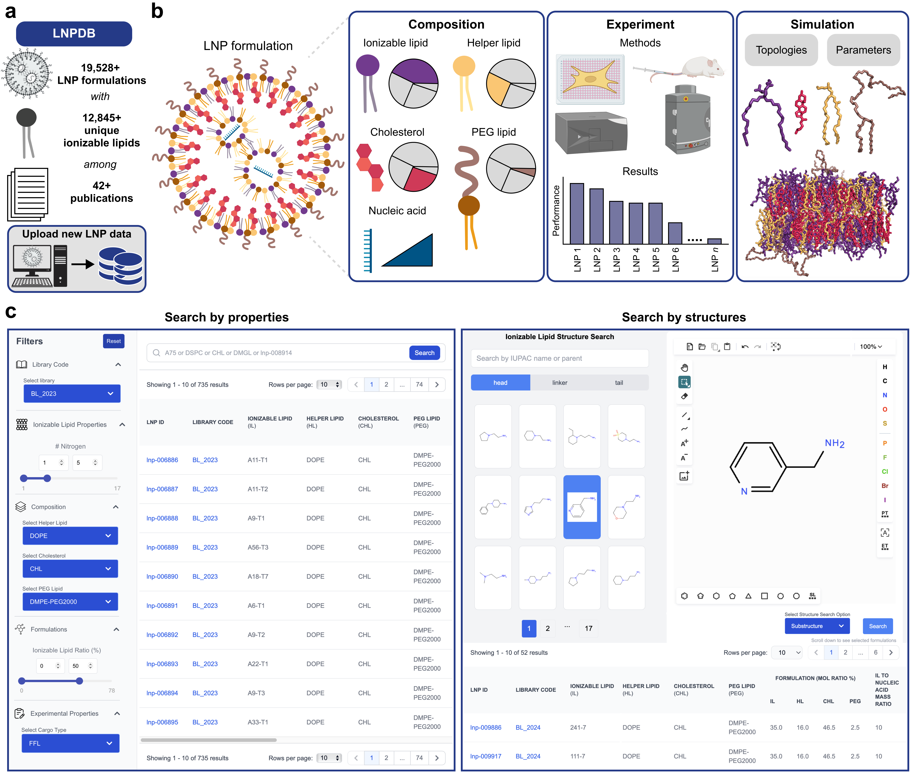

# LNPDB: structure-function database of lipid nanoparticles to advance data-driven design for nucleic acid delivery

<p align="center">
  
</p>

*Figure: LNPDB (https://lnpdb.molcube.com) is a data repository and web tool for compiling and uploading LNP structure-function data.*

## Description

This repository contains processing code to analyze the molecular dynamics trajectories evaluated in the paper "LNPDB: structure-function database of lipid nanoparticles to advance data-driven design for nucleic acid delivery" (*under review*).

_____

# Table of contents

- [Citation](#citation)
- [Repository structure](#repository-structure)
- [System requirements](#system-requirements)
- [Installation guide](#installation-guide)
- [Instructions](#instructions)

_____

# Citation

LNPDB: structure-function database of lipid nanoparticles to advance data-driven design for nucleic acid delivery. Evan Collins\*, Jungyong Ji\*, Sung-Gwang Kim\*, Jacob Witten, Seonghoon Kim, Richard Zhu, Peter Park, Minjun Jung, Aron Park, Rajith S. Manan, Arnab Rudra, Gyochang Keum, Eun-Kyoung Bang, Jun-O Jin, Robert S. Langer, Daniel G. Anderson\*, Wonpil Im\*

*Under review.*

# Repository structure

The repository is structured as follows:

- `/data`: contains example molecular dynamics trajectory data and implementation of LiON for LNPDB.
  - `/MD_trajectory_neutral`: this folder is currently blank due to file size limitations. Download [here](https://www.dropbox.com/scl/fi/wtq4asngi2t8v7ij1suqw/MD_trajectory_neutral.zip?rlkey=xj76yl9r3zy1i9cel7rubz1a2&st=qcayrgmo&dl=0). One representative trajectory is provided.
  - `/MD_trajectory_protonated`: this folder is currently blank due to file size limitations. Download [here](https://www.dropbox.com/scl/fi/4ec29ze4riamqjbj3c51f/MD_trajectory_protonated.zip?rlkey=0ed57ot7qyae39gxvi3ufq5ey&st=eun40vkr&dl=0). One representative trajectory is provided.
  - `/LNPDB_for_LiON`: this folder contains LNPDB organized to be trained by the LiON deep learning model to predict LNP delivery efficacy. This folder also contains the LiON trained model checkpoints.
  
- `/results`: contains the results for the different measures derived from molecular dynamics trajectories.

- `/scripts`: contains the Python scripts used to process data and generate results.

# System requirements

## Hardware requirements

To run the analysis code in this repository, it is recommended to have a computer with enough RAM (> 8 GB) to support the in-memory operations. Moreover, robust GPUs are recommended to run the all-atom simulations.

## Software requirements

This code has been implemented with Python version 3.9.20. Other Python versions will likely work. See below for creating an appropriate conda environment.

### OS requirements

This code has been tested on the following systems, although it should work generally for other OS types (e.g., Windows) with potentially minor required changes to package versions.

- macOS: Ventura 13.2.1

- Linux: Ubuntu 22.04

# Installation guide

## Install repository

```
git clone https://github.com/evancollins1/LNPDB.git
```

## Install Python modules

Create a conda environment (`lnpdb`) with the modules specified in `environment.yml`.

```
conda env create -f environment.yml
conda activate lnpdb
```

# Instructions

This repository includes code to analyze molecular dynamics trajectories and training the LiON deep learning model ([Witten et al., *Nat Biotech*, 2024](https://www.nature.com/articles/s41587-024-02490-y); [original repo](https://github.com/jswitten/LNP_ML)) for the LNP formulations in LNPDB.

## Analyzing MD trajectories

To analyze the provided molecular dynamics trajectories, follow along the Jupyter notebooks in the `/scripts` folder, i.e., `analyze_CPP_Rg.ipynb`, `analyze_CPP_V.ipynb`, and `analyze_other_metrics.ipynb`.

## Training LiON on LNPDB

To train the LiON deep learning model (based on [Chemprop](https://github.com/chemprop/chemprop)) on the LNP formulations of LNPDB, the database has been split (80% train/20% validation) into five cross-validation splits. 

To train LiON on LNPDB, run the following commands in terminal. Note that the trained model checkpoints are already provided in this repository, so it is not necessary to run the following commands.

```
for i in {0..4}
do
  echo "Running hyperparameter optimization for cv_$i"
  chemprop_hyperopt \
    --dataset_type regression \
    --data_path data/LNPDB_for_LiON/cv_splits/cv_$i/train.csv \
    --features_path data/LNPDB_for_LiON/cv_splits/cv_$i/train_extra_x.csv \
    --data_weights_path data/LNPDB_for_LiON/cv_splits/cv_$i/train_weights.csv \
    --separate_val_path data/LNPDB_for_LiON/cv_splits/cv_$i/test.csv \
    --separate_val_features_path data/LNPDB_for_LiON/cv_splits/cv_$i/test_extra_x.csv \
    --num_iters 5 \
    --epochs 10 \
    --config_save_path data/LNPDB_for_LiON/cv_splits/cv_$i/hpopt.json

  echo "Training model for cv_$i"
  chemprop_train \
    --dataset_type regression \
    --data_path data/LNPDB_for_LiON/cv_splits/cv_$i/train.csv \
    --features_path data/LNPDB_for_LiON/cv_splits/cv_$i/train_extra_x.csv \
    --data_weights_path data/LNPDB_for_LiON/cv_splits/cv_$i/train_weights.csv \
    --separate_val_path data/LNPDB_for_LiON/cv_splits/cv_$i/test.csv \
    --separate_val_features_path data/LNPDB_for_LiON/cv_splits/cv_$i/test_extra_x.csv \
    --separate_test_path data/LNPDB_for_LiON/cv_splits/cv_$i/test.csv \
    --separate_test_features_path data/LNPDB_for_LiON/cv_splits/cv_$i/test_extra_x.csv \
    --save_dir data/LNPDB_for_LiON/cv_splits/cv_$i/trained_model_checkpoints \
    --target_columns Experiment_value \
    --config_path data/LNPDB_for_LiON/cv_splits/cv_$i/hpopt.json
done
```

To used the trained models to predict delivery efficacy for new LNP data, place your new LNP data into the folder `/LNPDB_for_LiON`. Note that your new LNP data should be organized into two files: `insilico.csv` (see `LNPDB_for_LiON/cv_splits/cv_0/train.csv` for expected column organization) and `insilico_extra_x.csv` (see `LNPDB_for_LiON/cv_splits/cv_0/train_extra_x.csv` for expected column organization). Then run the following.

```
for i in {0..4}
do
  echo "Running prediction for cv_$i"
  chemprop_predict \
    --checkpoint_dir data/LNPDB_for_LiON/cv_splits/cv_$i/trained_model_checkpoints \
    --test_path data/LNPDB_for_LiON/insilico.csv \
    --features_path data/LNPDB_for_LiON/insilico_extra_x.csv \
    --preds_path data/LNPDB_for_LiON/cv_splits/cv_$i/insilico_results.csv
done

```

Moreover, fingerprint embeddings can be extracted from LiON for your new LNP data using the following command.

```
chemprop_fingerprint --checkpoint_dir data/LNPDB_for_LiON/cv_splits/cv_0/trained_model_checkpoints --test_path data/yanshu_fifthcomponent_il_insilico_data/insilico.csv --features_path data/LNPDB_for_LiON/insilico_extra_x.csv --preds_path data/LNPDB_for_LiON/cv_splits/cv_0/fingerprints.csv
```
